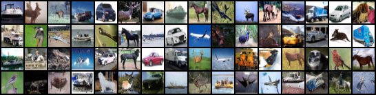
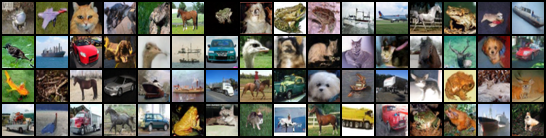

# ddpm-image-generation
Implementation of Denoising Diffusion Probabilistic Model (DDPM) for study purposes. <br/>
Read my blog on the mathematical foundations of DDPM: [Understanding Diffusion Model Through First Principles of Probability](https://rkg266.github.io/posts/2024/04/ddpm-math/) <br/> <br/>
Thanks to GitHub repo [@w86763777](https://github.com/w86763777/pytorch-ddpm?tab=readme-ov-file)

## Requirements
- Dataset: CIFAR10
- Python 3.10
- Packages Upgrade pip for installing latest tensorboard
  ```sh
  pip install -U pip setuptools
  pip install -r requirements.txt
- Download precalculated statistic for dataset: <br/>
  [cifar10.train.npz](https://drive.google.com/file/d/1YTvr4DULZcMe8NXwUZQ1Beu6S_0mv30Z/view?usp=sharing) <br/>
  Create folder `stats` for `cifar10.train.npz`. <br/>
  ```sh
  stats 
  └── cifar10.train.npz

## Training
- For GPU users, refer to the `for_pod_users` directory.
- Take CIFAR10 dataset to train.
  ```sh
  python main.py --train \
      --flagfile ./config/CIFAR10.txt
- [Optional] Overwrite arguments
  ```sh
  python main.py --train \
    --flagfile ./config/CIFAR10.txt \
    --batch_size 64 \
    --logdir ./path/to/logdir

## Evaluate
- A `flagfile.txt` is autosaved to your log directory. The default logdir for `config/CIFAR10.txt` is `./logs/DDPM_CIFAR10_EPS`
- Start evaluation
  ```sh
  python main.py \
    --flagfile ./logs/DDPM_CIFAR10_EPS/flagfile.txt \
    --notrain \
    --eval

## Results
- Inception score: mean (3.223), std (0.137) <br/>
   <br/>
- Inception score: mean (3.574), std (0.628) <br/>
   <br/>

## References
[1] [DDPM paper](https://arxiv.org/abs/2006.11239) <br/>
[2] Referred repo [@w86763777](https://github.com/w86763777/pytorch-ddpm?tab=readme-ov-file)
